<!--more-->
## Introduction
The most frequent comment I saw about Part 1 was concern about airflow. I had always planned on doing some kind of rough testing, but seeing the extra concern, which I already shared, I decided to do something a little more rigorous.

The goal is to ensure that in the closed box, the intake baffle provides at least as much air as is drawn in through the intakes of the racked devices. In my case, the biggest is an R720XD, and the rest are insignificant in comparison. The difficulty is that not only does the baffle itself restrict the airflow, but the dust filters do so even more.

The fans I used first were [Apevia AF58S-BK](https://www.amazon.com/gp/product/B01AIZFG96) 80mm case fans because the 5-pack was only $15! Only after I started testing did I notice that these are "silent" fans...

## Building an Intake Baffle
First, I built a 1:1 mock-up of the intake baffle. I started with the bottom structure.

Then marked the hole on top for the fans.

[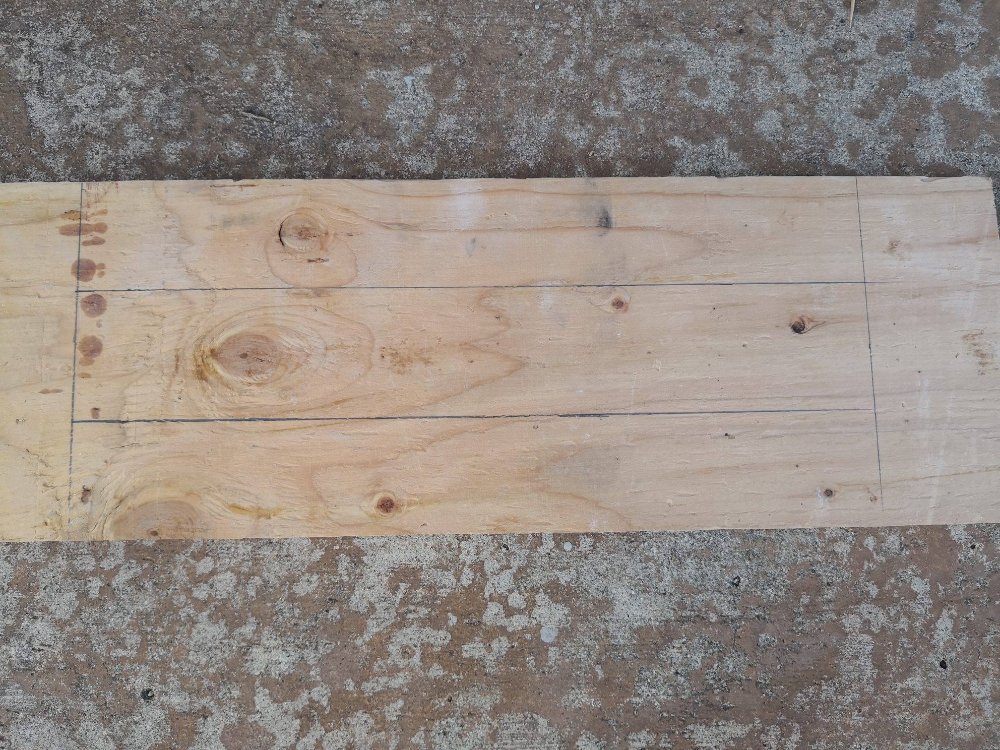](images/intakebuild3.jpg)

My design plan used a single, large, rectangular hole for the fans, but it turned out that in order to leave enough space for the screw holes, I had to block off a little bit of the fan blades. This will obviously reduce airflow, so in the real version, I'm going to use a 3" hole saw and give each fan its own hole, leaving plenty of space for screws. (I'll use threaded inserts in the plywood to screw the fans to)

[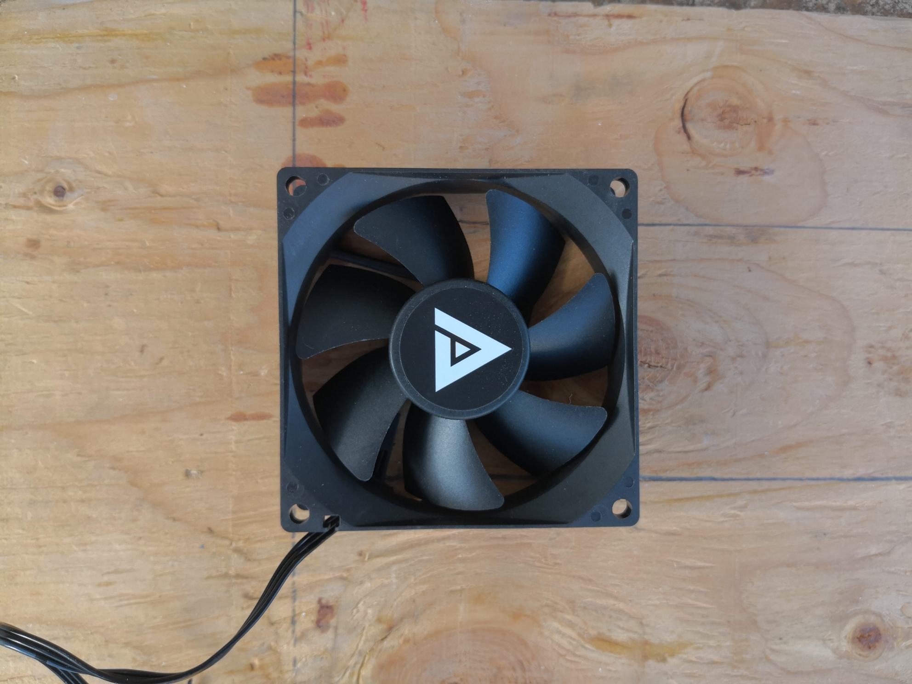](images/intakebuild2.jpg)

Finishing up the box.

[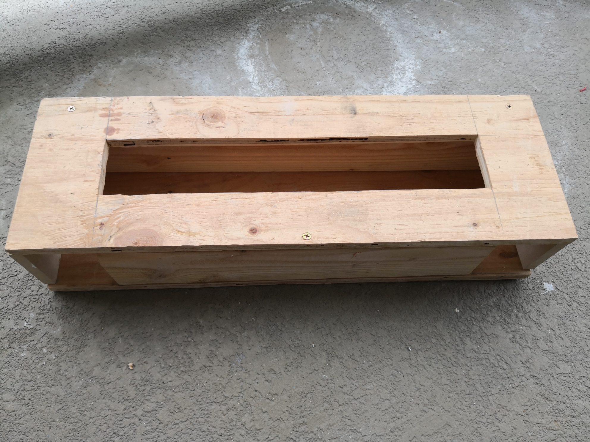](images/intakebuild4.jpg)

The real baffle will have some soundproofing material which further restricts airflow, so we need to test with that as well.

[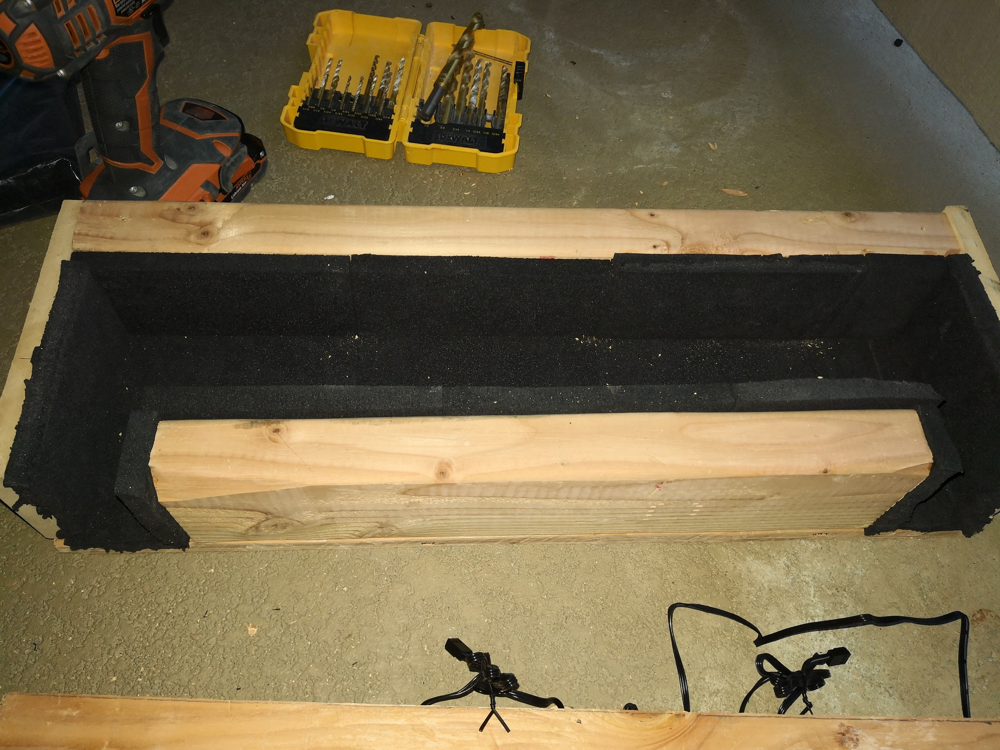](images/intakebuild5.jpg)

Finally, the test baffle is complete.

[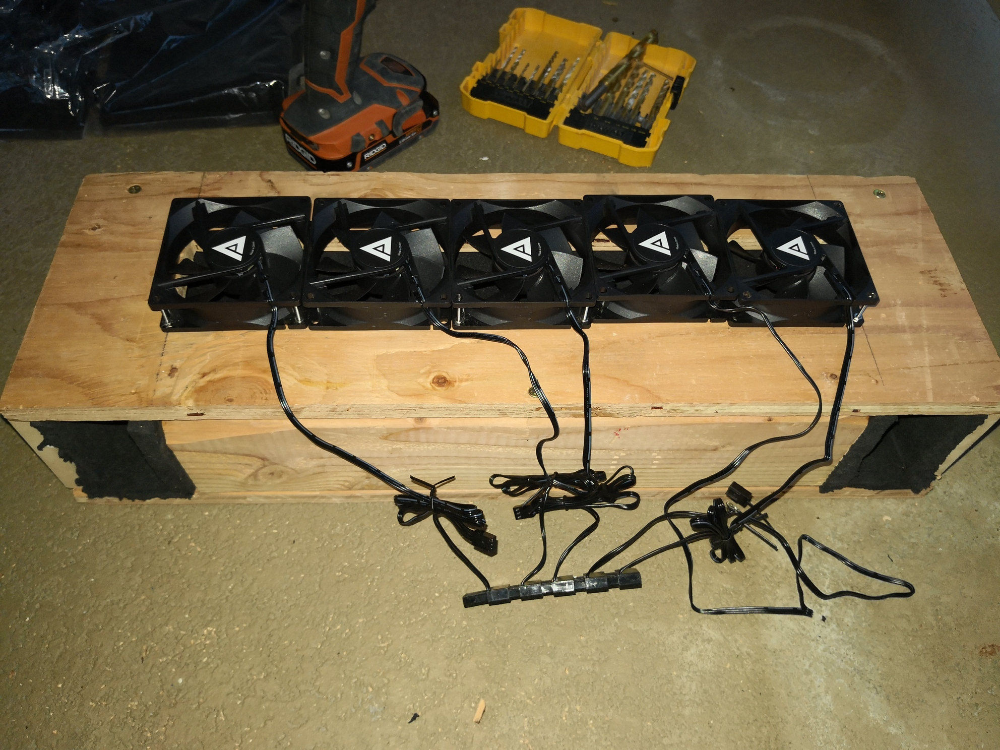](images/intakebuild6.jpg)

## Airflow Testing, Round 1
My original plan was to build the baffle, hold it up against the R720XD intake, and make sure some extra air was blowing around. Not exactly scientific. Instead I ended up buying an anemometer, which measures the speed of the air through it. Multiplying that by the cross-sectional area of the flow gives the airflow (CFM).

[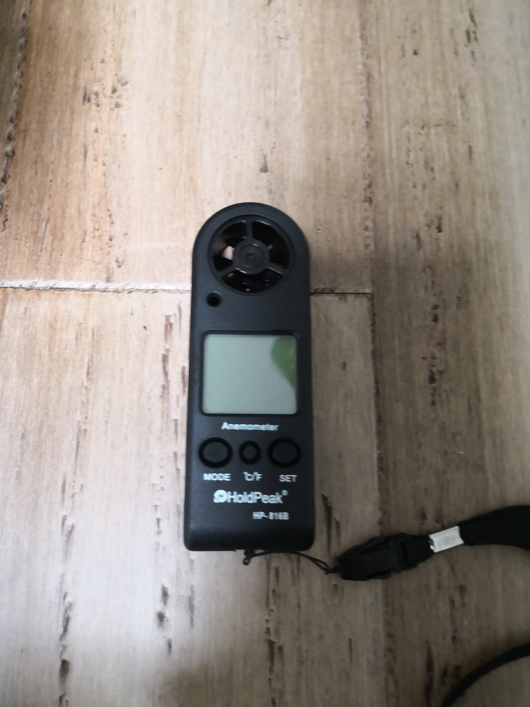](images/anemometer.jpg)

As a sanity check, I measured the air flow of one of the fans in free air and compared it to the rated CFM. The reading of `2.3 m/s`, multiplied by the flow's cross sectional area of `π(3"/2)²-π(1.5"/2)²` (which is the fan area minus the motor area), and a conversion factor of `1.367 (CFM / m*in²/s )` gets a result of `18.4 CFM`. The fans are rated at `17.1 CFM`, so the methodology is pretty close!

[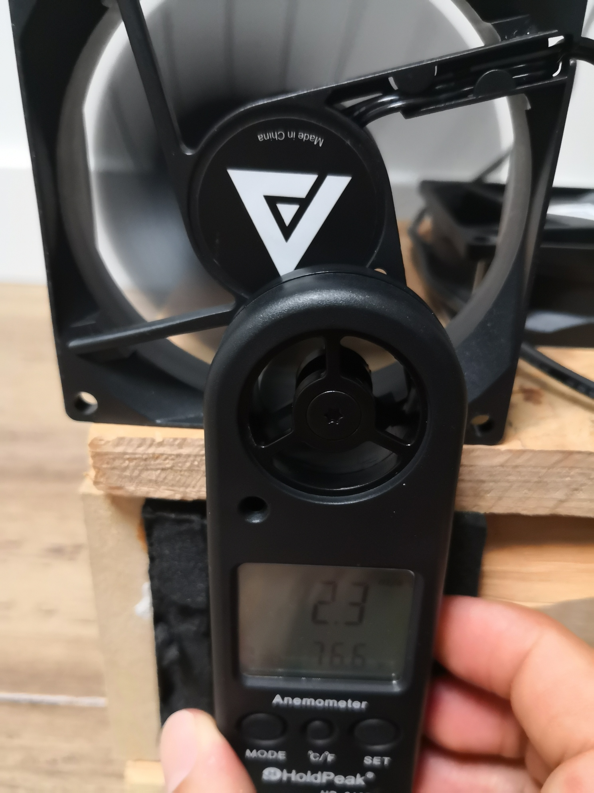](images/fan1.jpg)

The next step was to test the airflow through the baffle. This is a little trickier because the air flow through each fan, and even different areas around the fan will be different based on how much restriction there is on the air in that exact area (i.e. the impedance). A friend of mine who's an aerospace engineer offered the following explanation: "the flow varies radially in the baffle and intakes due to friction. The flow has to go from maximum in the middle to a dead stop at the walls. Each turn in the flow path results in momentum and pressure loss in the flow, so the fans waste more energy and pull less air overall"

I measured each fan at a couple of points around the blades, took an average, and added up the airflow for all the fans - `58 CFM`. That's already a pretty significant reduction from the `92 CFM` you'd get from 5 fans in free air.

To cross-check this measurement, I also measured the air speed through each of the intake holes, again in several locations, took an average, and multiplied by the area of the intake holes. The result: `25.3 CFM`.

[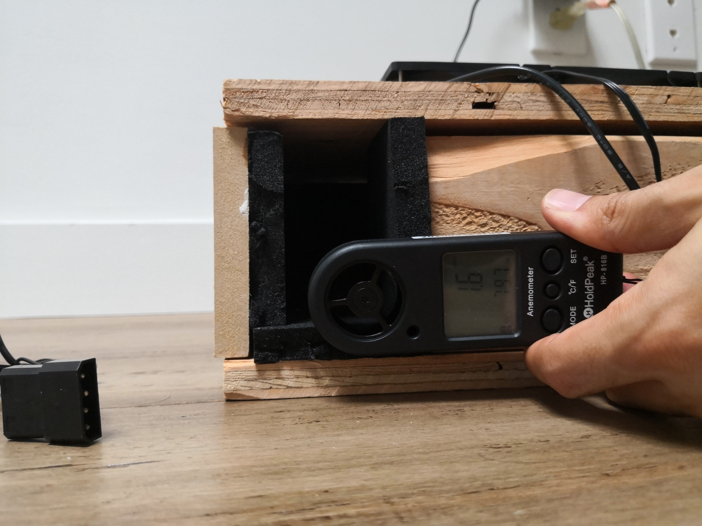](images/intake1.jpg)
[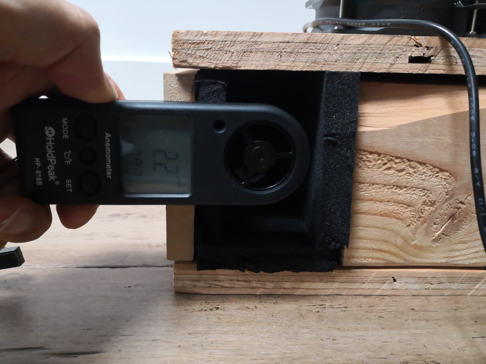](images/intake2.jpg)

What the heck... That's not even close. Well, when I built the test baffle, I wasn't particularly careful about measurements because I didn't think the precision would matter. But of course this left a bunch of gaps around the box, so some of the air flow through the fans was being pulled in through them instead of the intake holes. Nothing a little duct tape can't fix!

[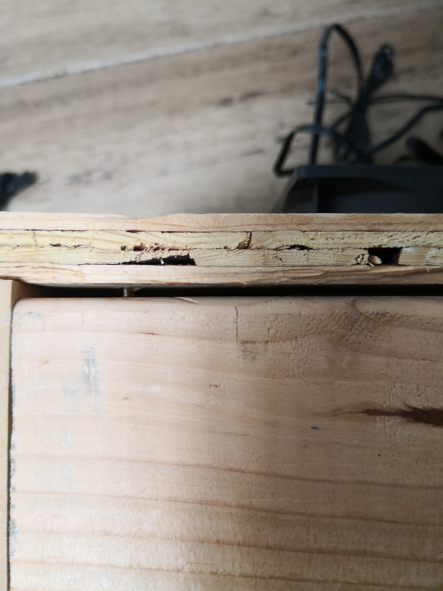](images/airgaps.jpg)

Repeating the measurements showed:

|Test|Airflow|
|:---|---:|
|Fans|45.6 CFM|
|Intake|30.5 CFM|

Interestingly, the measurement from the fans dropped by 25%, and the measurement from the intake increased by 20%. I suspect that the gaps in the baffle resulted in a lower impedance for the fans. Closing those increased the impedance and lowered the overall air flow. At the same time, it forced all the air through the fans to come in from the intake, increasing that measurement.

Measuring via the fans is more error prone because I'm doing a very rough estimate of the air flow's cross sectional area, made even worse by the issue of part of the airflow being blocked by the plywood as I mentioned above. Also, the anemometer's measurement fan is barely small enough to fit in the space of the fan blades. The intake measurement, on the other hand, is pretty fool proof because its a very regular, rectangular area, and I can easily take several measurements in different areas. Fun fact: you might have noticed in the picture that the speed of the air through the center of the intake is higher than the edges! All this to say that I will use the intake measurement to compare to the R720XD.

Speaking of, we also need to check how much air the R720XD is pulling in. This works out to be about `14 CFM` with the fans at about 70% speed. This means it could potentially go as high as `28 CFM`, since thrust varies with speed squared. I checked the [datasheet](https://www.delta-fan.com/Download/Spec/PFR0612UHE-F00.pdf) of the Delta fans in the R720XD, and each of the 6 fans is rated at `56 CFM` for a total of `336 CFM`. But that's with 0 pressure. I have drives in all 12 bays, which according to the PQ-curve puts it at nearly `1.8 in H2O` of pressure!

[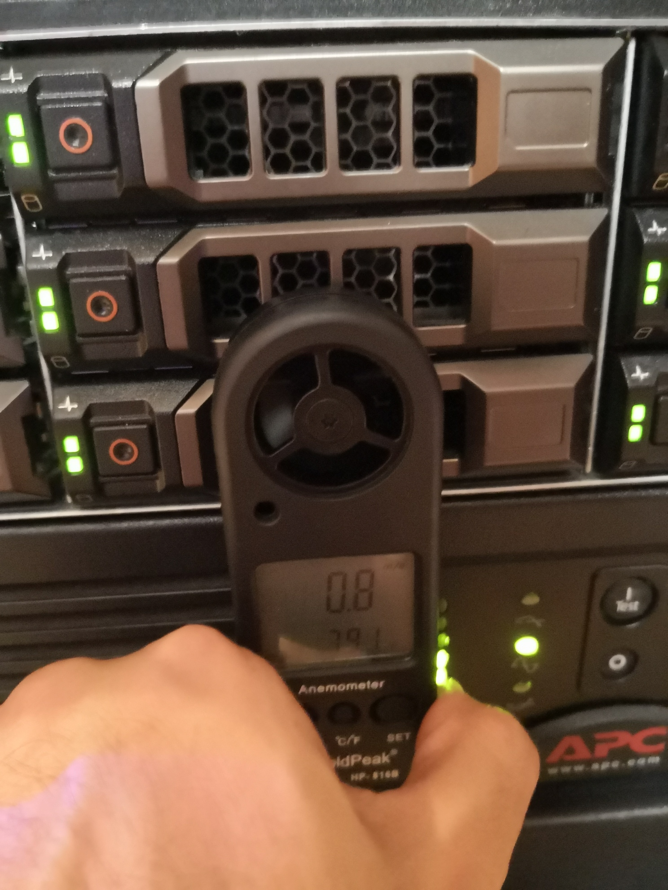](images/r720xd.jpg)

## Airflow Testing, Round 2
While it was interesting to see how much the baffle alone restricts airflow, ultimately the intake holes will be covered by a filter to prevent dust from entering. This will restrict airflow even further (by quite a lot, as it turns out), so testing with the filter is extremely important. I read a post from a user who made something similar using MERV-11 filter material but was still getting a fair amount of dust. They recommended I use something better, so I ended up buying a Filtrete MPR-1900 material, which is about MERV-13 ([MERV vs MPR: pdf](https://multimedia.3m.com/mws/media/1740587O/filtrete-merv-vs-mpr.pdf)). It turns out that when you're buying an AC filter, its the same price no matter what the size. So I bought the biggest one and now have enough filter material to last a lifetime.

Unfortunately, adding the filter rendered these fans completely useless. The airflow through the filter material was so low it didn't properly register on the anemometer. Checking via the fans themselves showed a 2-3X reduction in airflow. I measured the airflow around each fan as I did in Round 1 and calculated the CFM. From that, I assumed that my error factor between the fan and intake measurement methods was still the same, given that it was probably just a geometrical error. I extrapolated an intake CFM number, and the results were not good.

[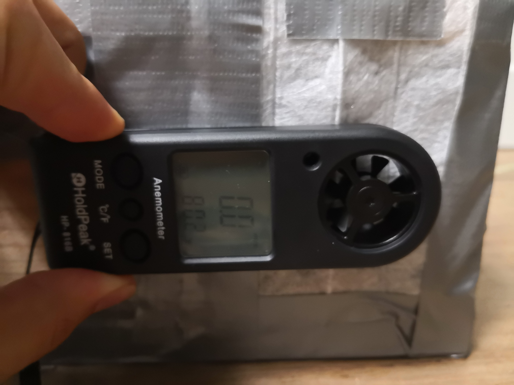](images/filter1.jpg)
[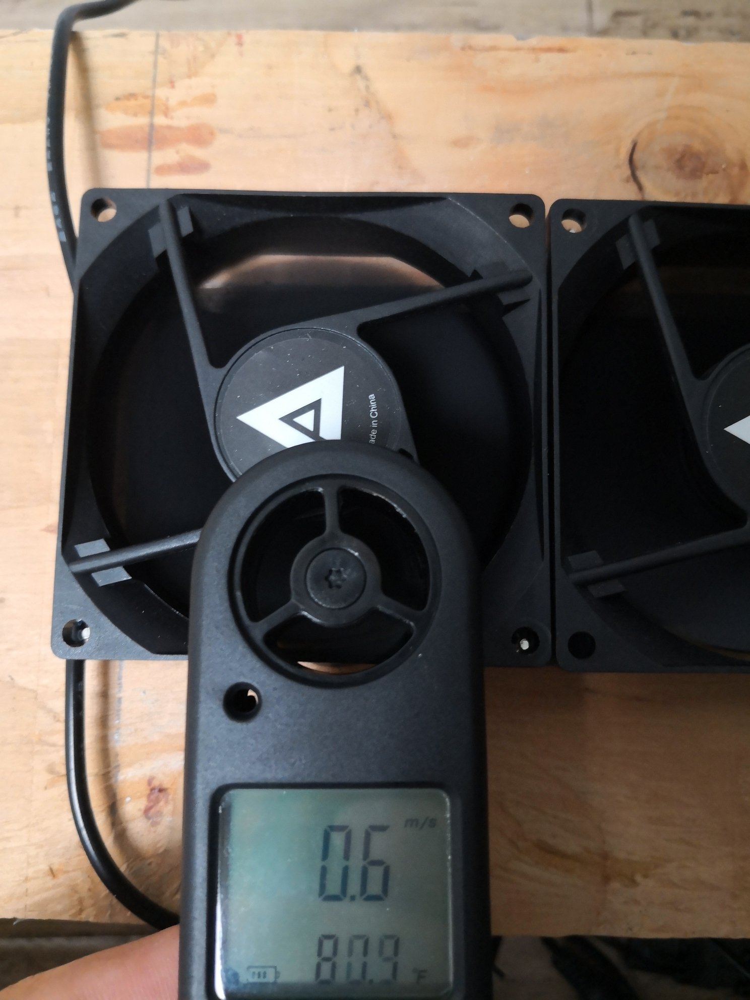](images/filter2.jpg)

|Test|Airflow|
|:---|---:|
|Fans with filter|24.8 CFM|
|Intake with filter (extrapolated)|16.3 CFM|

Obviously this would be a thermal disaster, so on to Round 3!

## Airflow Testing, Round 3
I chose those particular fans because I was trying to keep the cost down, and I couldn't find a better deal while searching for 80mm computer case fans. As I mentioned in the introduction, I later noticed they were advertsied as "silent" fans. And indeed, they were very quiet, but it means they don't fare well in environments with a lot of obstruction. After some searching, I discovered that DigiKey has an enormous selection of 80mm fans, some of which are very high-powered. As the RPM and CFM increase, though, so do the sound level, power, and cost.

I ended up compromising with two different sets of fans. The intake will use [Sanyo Denki San Cooler 80](https://www.digikey.com/en/products/detail/sanyo-denki-america-inc/9A0812G401/6192050) fans rated at `51 CFM` and `0.323 in H2O` for $10ea. The exhaust will use [Sunon EF Series](https://www.digikey.com/en/products/detail/sunon-fans/EF80251S1-1000U-A99/6198727) fans rated at `41 CFM` and `0.18 in H2O` for $2ea.

The rationale was to allocate more "budget" on the intake fans where the environment is more demanding because the pressure is higher. The exhaust doesn't have any filter and is also helped by convection, so it doesn't need to be as powerful or expensive. It can't be too weak, though, or it won't be able to keep up with the intake. I'm planning to add some fan speed control so I can tune the intake and exhaust airflow rates and hopefully achieve a slight positive pressure inside the box. The last thing to note is that these fans use a lot more power than the old ones, so I'll need to find a suitably beefy 12V power supply.

At full speed, these fans are loud. Nearly as loud as the fans on my R720XD. I was really impressed by how much the baffle reduced the amount of sound, though. Nearly all of the sound was directed in the same direction as the fan output, where there will be plenty of soundproofing material. When I put my ear to the intake holes, though, it was much much quieter.

[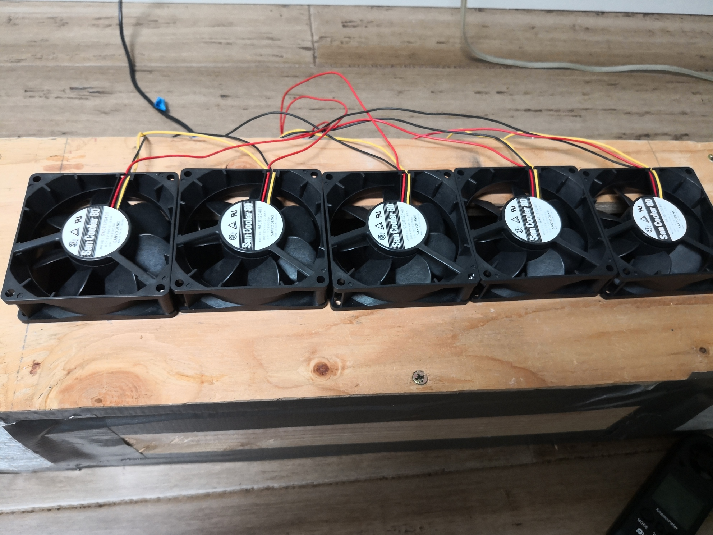](images/sanyodenki0.jpg)

With the same filters installed, the Sanyo Denkis can pull 4 times the amount of air as the old fans! In fact, measuring from the intake, these fans pull as much air with the filters as the old ones did without the filters.

[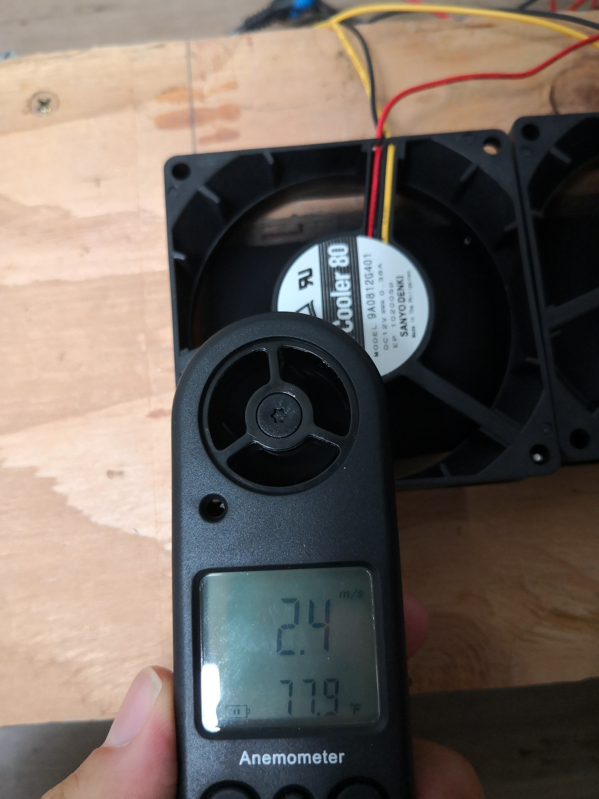](images/sanyodenki.jpg)

## Conclusion
Having tested these new fans, I feel much more comfortable about the airflow and noise situations. The new Sanyo Denkis give me a margin of about 10% over the maximum requirement of the R720XD, which it has yet to hit in its lifetime. The rest of my hardware has significantly smaller airflow requirements, so it should be covered by that margin.

Ultimately, I will need to do another test once I have the box built to see how the two baffles and fan sets interact in a closed system. I'm hopeful that controlling the speeds of all the fans will give me some wiggle room if things don't turn out perfectly. I also have a backup plan: I can use slightly worse filter material. I'd have to more regularly clean dust out of my hardware, but it would be worth the extra longevitiy of hard drives and CPUs if it keeps the temperatures lower.