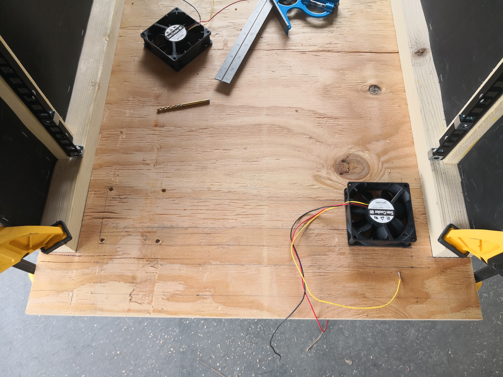

<!--more-->
## A Design Change
Before getting into the details of the build, I want to highlight one big design change since the last posts were published. The original intake baffle design was severely limiting the airflow because of the small inlets. A keen redditor suggested that by making the pressure drop over a larger surface area (i.e. making the filter bigger), the fans would be able to move more air, more easily. To accommodate this, I moved the filter to a shadowbox on the outside of the front door, and sized it to take a standard AC filter. The bottom of the shadowbox is open and fits over a hole in the base of the rack. The intake baffle is a "U" shape, pulling air down through the hole in the front, around the bend, and up into the interior.

## The Build
This post is intended to serve as a step-by-step guide for anyone who wants to build their own rack. All of the necessary drawings are available as PDFs (black and white with dimensions and color), as is the full Fusion360 project. I have a limited amount of woodworking experience; however, this project was very accessible because there were no advanced techniques or joints, just a lot of cutting, gluing, and fastening. Confidence with powertools is definitely necessary.

The final Fusion360 drawing can be found online [here](https://a360.co/3nu3DzU), and an archive file of it .

## Tools
At the bare minimum, you'll need:
* Circular saw
* Jig saw
* Drill with various bits
* 3" hole saw
* Screwdriver or impact driver
* Staple gun
* Allen wrench 
* Tape measure
* Square
* Clamps

## Materials
This list is not complete, but it has most of the big items. Things like wood glue, fasteners, and some of the extra low voltage wiring materials I used for fun/convenience are not listed. Prices are approximate and as of the time of writing. I was able to get many of the materials for free (especially lumber and soundproofing) by asking around at Home Depot and some local acoustic contractors for scraps.
* [1/2" Plywood (4'x8')](https://www.homedepot.com/p/Sheathing-Plywood-Common-15-32-in-x-4-ft-x-8-ft-Actual-0-438-in-x-48-in-x-96-in-20159/206827282) - $50
* [1/2" MDF (1.5sqft needed)](https://www.lowes.com/pd/MDF-Actual-0-5-in-x-24-in-x-4-ft/1000080511) - $22
* 1x [8ft 2x4](https://www.homedepot.com/p/2-in-x-4-in-x-96-in-Prime-Whitewood-Stud-058449/312528776) - $8
* 2x [8ft 1x2](https://www.homedepot.com/p/1-in-x-2-in-x-8-ft-Furring-Strip-Board-160954/100009348) - $5
* 3x [8ft 2x2](https://www.homedepot.com/p/2-in-x-2-in-x-8-ft-Furring-Strip-Board-Lumber-75800593/304600525) - $15
* 1x [8ft 1x3](https://www.homedepot.com/p/1-in-x-3-in-x-8-ft-Spruce-Pine-Fir-Common-Board-307488/306896206?MERCH=REC-_-searchViewed-_-NA-_-306896206-_-N&) - $5
* [1-1/2"x30" Piano Hinge](https://www.homedepot.com/p/Everbilt-1-1-2-in-x-30-in-Bright-Nickel-Continuous-Hinge-15175/202034057) - $20
* 2x [1-1/16"x30" Piano Hinge](https://www.homedepot.com/p/Everbilt-1-1-16-in-x-30-in-Bright-Nickel-Continuous-Hinge-15174/202034144) - $18
* 2x [4ft 1/16" Aluminum Angle (1-1/4")](https://www.homedepot.com/p/Everbilt-1-1-4-in-x-48-in-Aluminum-Angle-with-1-16-in-Thick-800037/204373304?MERCH=REC-_-searchViewed-_-NA-_-204373304-_-N&) - $24
* [8ft x 1-1/2" x 1/8" Aluminum Flat Bar](https://www.homedepot.com/p/1-1-2-in-x-96-in-Aluminum-Flat-Bar-with-1-8-in-Thick-802567/204273945) - $28
* [3M 90 Hi-Strength Spray Adhesive](https://www.homedepot.com/p/3M-14-6-oz-Hi-Strength-90-Low-VOC-Spray-Adhesive-90-VOC40DSC/316351815) - $15
* [MLV (24sqft total)](https://www.acoustimac.com/soundproofing-massloaded-vinyl-1lb50sf) - $65
* [Owens Corning 703 (24sqft total)](https://www.buyinsulationproductstore.com/owens-corning-703-fiberglass-acoustic-board-1-3/) - $20
* 8x [2x 12 Pack Acoustic Panels (32sqft total)](https://www.amazon.com/gp/product/B08TC683R6) - $104
* 4x [Penn Elcom Rack Strip with Square Holes](https://www.pennelcomonline.com/en/Penn-Elcom-12U-Full-Hole-Rack-Strip-with-Square-Holes-2mm008-R08632MM-12/m-6519.aspx) - $44
* [EZLok Threaded Insert #8-32 (100 pack)](https://www.amazon.com/gp/product/B002KSTB9G/ref=ppx_yo_dt_b_search_asin_title?ie=UTF8&psc=1) - $15
* [5x Sanyo Denki San Cooler 80](https://www.digikey.com/en/products/detail/sanyo-denki-america-inc/9A0812G401/6192050) - $60
* [5x Sunon EF Series](https://www.digikey.com/en/products/detail/sunon-fans/EF80251S1-1000U-A99/6198727) - $32
* [12V, 5A DC Power Supply](https://www.amazon.com/gp/product/B01MT187LS) - $17

#### Summary
* Lumber: $103
* Sound-proofing: $189
* Fans: $92
* Misc: $181

**Total: $565**

## Preparation
I live in a condo, so I had to set up my work area outside in our covered parking space. It took a while to set up and teardown every time I wanted to do some work and this limited the pace of my progress. Because I used a circular saw for all of the cuts, I made a rip cut and a cross cut jig to keep everything straight and square. They are an absolute must, and there are plenty of guides on how to make them.

I really liked using the circular saw for the rip cuts, as opposed to a table saw, but a miter saw would've saved me a ton of time on the cross cuts.

#### ⚠️ Lesson Learned - Termites!
Before you even get started, if you live anywhere with termites, you should treat your lumber. I learned this the hard way and had to treat the rack after it was already built. I used a borate-based treatment solution ([PenaShield](https://nisuscorp.com/product/penashield)) which is basically a penetrating water-based "stain." Unfortunately, it caused parts of the wood to expand which ruined some of my tight fits.

 

## Side Panels
[Drawing - Black & White with Dimensions (pdf)](pdfs/sidepanel.pdf)

[Drawing - Color (pdf)](pdfs/sidepanel_color.pdf)

The build starts with the two identical side panels.

First, I cut the lumber to size. Then, one by one, I clamped each 2x2 to its piece of plywood just right to get a nice clean edge, and pre-drilled holes through both. Then I took the clamps off, applied some wood glue, and fastened everything together. I found it helpful to poke the screw ends up through the plywood just a little first, so I could line up the corresponding holes in the 2x2's to the ends sticking out of the plywood. Pre-drilling the holes like this ensured that the pieces lined up as intended when I glued them together. I used screws and glue so that the screws would hold the pieces together and I wouldn't have to leave clamps on every piece.

For attaching plywood to 2x2's, I used #6 1-5/8" screws.

Then I attached the 1x2's using the same pre-drill and glue technique. I used #6 1" screws through the exterior side of the plywood into the 1x2's. I also used 2x #8 3" screws on each top and bottom, through the 2x2's and into the length of the 1x2's for overkill-level support. It is extremely important to pre-drill those holes because there's not much space and the wood is narrow.

Getting these in the right place and making them square is important to ensure the rack rails are all in the correct location and orientation relative to each other.

Finally, I screwed the rack rails themselves into the 1x2's. (The screw size will depend on the rails you buy). I designed panels such that there is a 1/8" gap on top and bottom of the rails.

In retrospect, I wish I had made the rack 1-2" deeper, as mentioned in the drawings, to allow for a layer of the Owens Corning on the front door.

   

#### ⚠️ Lesson Learned - Dimensional Lumber
Most experienced woodworkers already know - you can't trust the dimensions of anything you haven't cut yourself. 2x2's are not 2"x2", nor are they even the 1.5"x1.5" nominal dimensions. I actually made the mistake of cutting the rack rail supporting 2x1's first, to the dimensions in the drawing, but they were too short by about 1/4"! I ended up having to use shims to fill in the extra space.

#### ⚠️ Lesson Learned - Pre-Drilling
In addition to the benefits mentioned above, pre-drilling will also help prevent the plywood and dimensional lumber from splitting. I did find, though, that I would often rip the heads off the screws because I wanted them to be flush. I ended up using [this countersink bit set](https://www.homedepot.com/p/DEWALT-Steel-Countersink-Set-3-Piece-DW2535/100531905) to give the screw heads a little more space as they held tight.

## Soundproofing
As described in the first part of this series, the soundproofing plan is based on three layers. The first is 1lb mass-loaded vinyl (MLV). This should be stapled to the plywood instead of glued because it needs to be able to vibrate independently of the plywood. The second is fiberglass board or rockwool. My original plan was to use spray adhesive to attach it to the MLV. The final layer is acoustic foam, also adhered to the MLV.

To save time and money, I decided to just start with the MLV layer and add the other layers only if necessary. I did use the foam in a few places, though, like the baffles.

## Bottom Panel
[Drawing - Black & White with Dimensions (pdf)](pdfs/bottompanel.pdf)

[Drawing - Color (pdf)](pdfs/bottompanel_color.pdf)

I was very paranoid about getting the rack width exactly right. To make sure I didn't make a mistake, I used rack blanks to hold the two sides upright at exactly the right spacing (and measured at the top, middle, and bottom). Once I had everything secure, I measured the precise width necessary for the bottom panel, and cut the plywood to size. 

At this point I clamped the side panels to the bottom panel with nice flush edges and re-measured the rail-to-rail spacing to make sure it was still good. Then I started drilling out the mounting holes for the intake fans. I drew an outline of where the fans would go to line them up nicely, then used one of the actual fans as a drill guide to get the holes in precisely the correct spot. I used threaded inserts designed for plywood that allowed me to use machine screws to fasten the fans directly to the bottom panel. I drilled and installed 4 per fan, but ended up only using 2 each. The insert and machine screw size will ultimately depend on the fans, but #8-32 should probably work for most 80mm fans. I also drilled out the fan mounting holes to be a little wider so the screws weren't a tight fit - I wanted to avoid transfering fan vibration to the panel. 

Finally, I used a 3" hole saw to cut the intake holes (I draw lines between opposite mounting holes to find the center of the circle where they intersected).

#### ⚠️ Lesson Learned - Soundproofing Foam
As you'll see later on, I glued some piecemeal soundproofing foam to the bottom of the bottom panel to help with intake fan noise. The coverage isn't great and it was annoying to do. It would've been a lot easier to glue the foam on first, then drill and cut the holes in the bottom panel and foam at the same time, since the foam is very easy to cut through. I did this with the exhaust baffle and got a much cleaner result.

   

I used a jigsaw to cut the rectangular hole for the intake baffle (you can see this hole in images later on). I fastened the side panels and bottom panel together one at a time. I clamped it together, flipped it upside down, with the side panel hanging off the edge of my work table, and pre-drilled the holes. I flipped everything back rightside up, unclamped it, and fed some screws through from underneath the bottom panel as a guide. I applied the glue and screwed it together from underneath. I used the same #6 1-5/8" "drywall" screws as before. This clamp, pre-drill, glue, fasten process should be getting familiar. I did the same thing for the other side.

## Top Panel
[Drawing - Black & White with Dimensions (pdf)](pdfs/toppanel.pdf)

[Drawing - Color (pdf)](pdfs/toppanel_color.pdf)

The top panel is fairly easy, as its just two pieces of plywood cut to fit based on the dimensions already determined. Note that there are two pieces, since there is a double hinge for the front door. The distribution of depth between the two pieces will depend on the exact piano hinges used.

There is a horizontal 2x2 spanning the width of the rack between the two top horizontal supports. I don't seem to have a picture of it in the build process, but its visible later on. It is in the drawings and is necessary to serve as a rest for the front door and double hinge. Using the same procedure as always, I fastened just the larger of the two top panels, leaving the smaller one for when the front door was ready. (I did make sure the fit of the smaller one was good, though). It's starting to look like a real box!

## Back Panel
The back panel requires a 1x2 support at the top and bottom between each set of two horizontal supports. I definitely went overboard with fastening these, but I didn't have a reason not to. At this point, with a solid box, I ended up moving everything inside so I could work without having to set up and take down the workspace every time. I took over the loft, put some tarps and plastic down, and finished the work there. (I did do all the big cuts outside to avoid too much sawdust).

Before I added the back panel itself, I added two electrical boxes - one for power and one for data. I drilled out a decent sized hole underneath to fit the clamps and screwed the boxes directly to the bottom panel. The back panel itself is an easy cut and fasten, nothing special here. I added the MLV to the back panel, but waited for the top and bottom until the very end.

     

## Rear Access Panels
The rear access panels fit exactly in the open space left at the rear of the rack. I cut those based on the measurements of each side individually, since I wanted a tight fit (to keep it airtight), and by this point things had deviated slightly from the designed measurements because of the accumulation of many small errors. The two panels are secured in place by an angle iron and a flat bar on each side. I actually used aluminum, since its a lot softer and easier to work with, but any metal will work.

 

## Front Door
[Drawing - Black & White with Dimensions (pdf)](pdfs/frontdoor.pdf)

[Drawing - Color (pdf)](pdfs/frontdoor_color.pdf)

The front door is a double shadowbox that provides a place for the intake filter to sit.

Completing it required a lot of cutting and gluing, and again I went way overboard. I used screws to hold things together so I could reclaim my clamps and continue work. I left many of them in; but some I took out and filled with wood filler to keep it airtight. It fit a 16x20x1" AC filter perfectly. I ended up adding swiveling scrap piece to hold the it in place since it would fall out otherwise. The suction from the intake fans keeps it pressed nicely against the inner shadow box, though.

I attached the piano hinges to the door and the smaller bit of the top panel that was not yet attached. I did this with the door in place to make sure everything was positioned correctly and the hinges would operate well. Screwing into the edge of the front door's plywood like this definitely requires pre-drilling and some care. Unfortunately, the screws that came with the hinges were longer than the thickness of the plywood, so they stuck out. To deal with this, with everything in place, I predrilled a small hole through the top panel and into the 2x2 underneath. Then I removed the top panel and drilled the holes in the 2x2 even larger so the screws would just sit inside them. This is probably good enough. In my case, after I treated the lumber for termites, the screws no longer fit in their holes snugly. I opted to cut the bottoms off with an angle grinder and fill the holes with wood filler.

      

## Intake Baffle
[Drawing - Black & White with Dimensions (pdf)](pdfs/intakebaffle.pdf)

[Drawing - Color (pdf)](pdfs/intakebaffle_color.pdf)

The intake baffle is a pretty simple box made of plywood, a 2x4, and some 1/2" MDF. The 2x4 sits directly under the rack rails, so it bears almost half of the weight of the rack. It may be possible, and easier, even, to use MDF all around, but I didn't want to take any chances with the load. The difficulty comes in cutting the MDF to be exactly the same height as the 2x4, so it sits flush against the bottom of the bottom panel. It's also important to get nice right angles on the cuts. I didn't do a particularly great job at any of that, and ended up doing a lot of sanding and caulking to get it airtight.

I used the soundproofing foam all around the intake baffle to reduce fan noise. I used 3M 90 high strength spray adhesive. It worked well enough since the foam was a tight fit and there's not much movement.

I flipped the rack upside down for intake baffle attachment, using the same clamp, pre-drill, unclamp, glue, drill process. The MDF is pretty thin, so take care putting screws into it. I ended up splitting some of it and had to glue it back together. I also added the support 2x4 on the rear of the rack at this point, under the rear rails. I added MLV underneath the intake baffle and the rear support leg to prevent vibrations from transferring to the floor (because it's going to live in the attic above living spaces).

    

## Front Door Installation
Having a good seal on the front door is essential for dustproofing. I used a foam weather stripping around the edges of the box. I ended up also adding a 1/4" strip of plywood on the bottom of the rack so I could seal the bottom as well. I used two "tight-seal" sash locks to hold the door firmly against the weatherproofing.

  

## Exhaust Baffle
[Drawing - Black & White with Dimensions (pdf)](pdfs/exhaustbaffle.pdf)

[Drawing - Color (pdf)](pdfs/exhaustbaffle_color.pdf)

The exhaust baffle is slightly easier than the intake since it is MDF all around. I cut the bottom plywood piece to precisely fit the remaining opening on the top of the rack. After gluing the box together (except the top), I drilled the holes for the exhaust fans. The same tips from the bottom panel apply here. This time, I thought ahead and glued the acoustic foam to the inside of the baffle first, and the result was much cleaner. I put the MLV on the bottom before installing the baffle, using a utility knife to cut the large holes, and a drill bit for the mounting holes, since it sort of self-centered itself.

  

## Low Voltage Wiring
I went a little crazy on the low voltage wiring, but it was fun. For the data wires, I bought a bunch of keystone jacks, a 6-port keystone face plate for the interior, and a 6-port keystone surface mount box for the exterior. It was a little painful getting all the wires to fit in the electrical box because it's not very deep - 1 coax and 2 ethernet. I think I could still squeeze in one or two more ethernet cables, though.

I thought controlling the fan speed might be necessary to ensure positive air pressure in the box or to manage the sound levels. In reality, the intake fans are so much stronger than the exhaust fans even with the rack fully loaded, that it doesn't really matter. Similarly, my R720XD is so much louder at half fan speed than the intake fans are at full speed. But I did it anyways and I'm very happy with it.

I used two panel-mount potentiometers with die cast knobs, two 3A adjustable switching regulators, a 60W, 12V power supply, and a bunch of 4-pin desktop fan splitters, extenders, and pins and housings (because the fans came bare wire). I modified the regulator boards to add a 3pin header in place of the trim pot they came with, so I could connect it to knobs in the front of the rack. The feedback networks on these regulators are configured to support much higher DC voltages, so the output voltage maxed out long before the knobs hit their end. I replaced the fixed feedback resistor to give me more gradual control with the knobs.

I glued the regulators to the top of the power supply and left it all in the back of the rack. I ran the fan extension cables along the edge of the rack to the intake fans up front, and up one of the vertical supports to the exhaust fans. I also ran two wires for each potentiometer. I just used some spare CAT5e twisted pairs for that.

     

## Soundproofing, again

As mentioned earlier, I mainly used MLV for the soundproofing, but there were a few places where it was relatively easy to use the foam. One of those was the space at the front of the side panels, and the other was the inside of the front door. My thought was that most of the sound will be coming from the front of the server rack (this turned out to be mostly true), so it would be worth it to add some extra material here. Again, I used 3M 90 spray adhesive to attach the foam, but this time to the MLV. It held pretty well except for the pieces on the front door, which kept flying off when I'd pull the door open. I ended up pulling all of the foam off the front door and applying significantly more adhesive. That seemed to do the trick and I haven't had any issues since. I'm not sure how well it would hold the rigid fiberglass to the MLV on the top panel, though, if I decide to add that.

 

## A Soundproof, Dustproof Server Rack

It's finally done! The whole project took me about 3 months of intermittent work. I probably could've knocked it out in a few days with more consistency, better tools, and a workspace that didn't require setup and takedown. All of the pictures are available in a gallery [here](https://imgur.com/gallery/nzzGnhS)

    

<blockquote class="imgur-embed-pub" lang="en" data-id="BnOBhXm"  ><a href="//imgur.com/BnOBhXm">Soundproofing</a></blockquote>

## Six Months Later...

I actually finished the rack about six months before I finished this post, so I've had some experience using it. Overall, I'm quite happy with how things turned out. It's fairly easy to work with - the big front door makes it very easy to rack and re-rack. The rear access works well enough, but it is a little bit of a pain. Screwing rails in was cumbersome because all of my screwdrivers were too big to fit in the short depth, so I ended up having to use an offset screwdriver which is slow and painful. It's well worth the inconvenience to be able to push it all the way up against the wall, though.

The airflow is excellent. The baffles and fans have no problem whatsoever keeping up with the demands of the equipment inside. R720XD CPUs "idle" at around 15C above ambient. I also did some simplistic load testing via Dell's diagnostics utility, and the CPUs peaked at 75C. These temperatures are almost exactly what they were when I had the server in open air, which is no surprise. The intake fans can move significantly more air than the R720XD fans, which are limited by the severe restrictions of having it fully populated with SAS drives. I did notice that with the rack exhaust fans set at a lower speed, as I had them initially, there was some hot air sitting near the back of the rack near the 12V power supply. Increasing the exhaust fan speed solved this problem right away.

Soundproofing is also excellent. Even when the R720XD is under load, the rack is almost totally inaudible. As I expected, most of the server fan noise actually leaks through the intake baffle, which does a good job of knocking it down. Very non-rigorous sound level measurements using an Android app show I get about 6dB in reduction. There is one aspect in which soundproofing performance leaves some to be desired, though. There is some sort of low frequency beating phenomenon caused by the fans, and its roughly at 60Hz (or multiple thereof). This vibration gets transferred to the body of the rack and then through the floor. It caused an audible hum in the bathroom underneath the part of the attic where the rack sits. I managed to reduce the hum by putting a piece of MLV underneath the rack, to isolate it from the floor. Eventually, though, it seemed like the effects wore off (perhaps due to compression of the MLV under the weight of the rack). I then added some pieces of soundproofing foam underneath the rack, because its quite a bit thicker, and that helped reduce the hum further. It is still audible if it's quiet and you're really paying attention, though. I suspect part of the problem overall is that the rear of the rack is totally open, and has a nice cavity for sound to bounce around in. I think the solution here would be to add the rigid fiberglass insulation (Owens Corning 703) and possibly more soundproofing foam to prevent some of that reverberation, but so far it doesn't bother me enough that it would be worth taking all of the equipment out.
